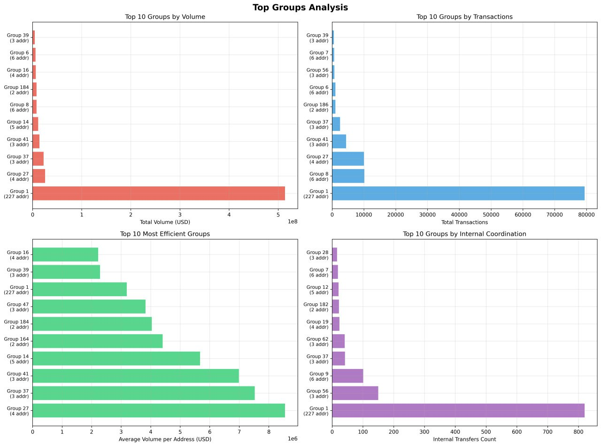
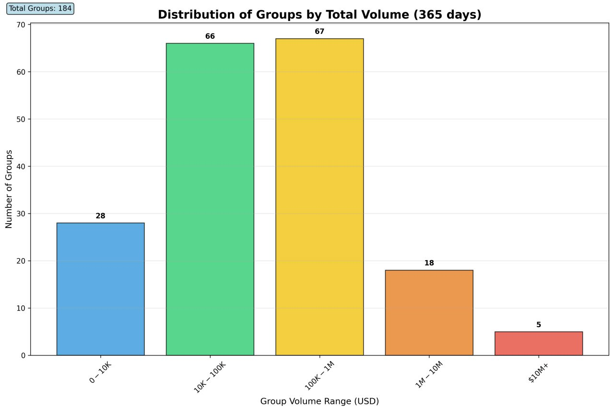

# Mintegrity - blockchain transaction analysis toolkit


Most Web3 users juggle multiple wallets across different protocols and services. 
Our analytics connect these fragmented identities by analyzing on-chain behavior patterns, giving you an insight into your true audience.


Stop guessing what your community wants. With Mintegrity's user analysis, you'll understand who you're serving - and create products that resonate with their actual needs.

## Features
Mintegrity is a toolkit for analyzing ETH blockchain transaction data, including direct wallet interactions, contract interactions, and interactions among popular tokens.
It enables users to build, visualize, and analyze transaction graphs to gain insights into blockchain networks and identify patterns of behavior.

- **Transaction Graph Building**: Create comprehensive transaction graphs from blockchain data
- **Graph Visualization**: Generate interactive visualizations of transaction networks
- **Node Categorization**: Automatically categorize addresses based on heuristics
- **Wallet Grouping**: Group related wallets based on transaction patterns

## Installation

1. Clone this repository
2. Create a virtual environment:
   ```
   python -m venv venv
   venv\Scripts\activate
   ```
3. Install dependencies:
   ```
   pip install -r requirements.txt
   ```
4. Create a `.env` file with your API keys (if needed)

## Usage Examples

The `cases\rocketpool` directory contains complete examples demonstrating how to use the framework:

### Building Transaction Graphs

[graph_building_rocketpool.py](cases\rocketpool\graph_building_rocketpool.py) demonstrates how to build a transaction graph for Rocket Pool contracts:

```python
from scripts.graph.building.transactions_graph_builder import TransactionsGraphBuilder
from scripts.graph.model.transactions_graph import TransactionsGraph
from dateutil import parser
from scripts.commons.model import *
from scripts.graph.util.transactions_graph_json import save_graph_to_json

FROM_TIME = int(parser.parse("2025-02-25T00:00:00Z").timestamp())
TO_TIME = int(parser.parse("2025-05-24T00:00:00Z").timestamp())

# Define contracts to analyze
contracts = {SmartContract("0xdd3f50f8a6cafbe9b31a427582963f465e745af8")}

# Build the graph
graph: TransactionsGraph = TransactionsGraphBuilder(contracts, FROM_TIME, TO_TIME).build_graph()

# Save the graph
save_graph_to_json(graph, "output_path.json")
```

### Visualizing Transaction Graphs

[visualization_rocketpool.py](cases\rocketpool\visualization_rocketpool.py) shows how to create interactive visualizations:

```python
from scripts.graph.visualization.transaction_graph_visualization import visualize_transactions_graph

# Load a graph
graph = TransactionsGraph.from_dict(json.load(open(GRAPH_PATH)))

# Visualize the graph
visualize_transactions_graph(
    graph=graph,
    filename="output_visualization.html"
)
```


### Wallet Grouping

[wallet_grouping_rocketpool.py](cases\rocketpool\wallet_grouping_rocketpool.py) demonstrates how to group related wallets based on transaction patterns:

```python
from scripts.graph.analysis.wallet_groups.wallet_grouping import analyze_and_visualize_wallet_groups

# Load a graph
graph = TransactionsGraph.from_dict(json.load(open(GRAPH_PATH)))

# Group wallets in the graph
wallet_groups, coordination_scores, group_distances = analyze_and_visualize_wallet_groups(graph, OUTPUT_PATH, COORDINATION_THRESHOLD)
```





### Clustering Analysis
[clustering_rocketpool.py](cases\rocketpool\clustering_rocketpool.py) demonstrates advanced clustering techniques:

```python
from scripts.graph.analysis.clustering.wallet_clustering import extract_wallet_features, cluster_wallets_kmeans

# Extract features from wallet nodes
wallet_features = extract_wallet_features(graph, categorized_nodes)

# Apply clustering
kmeans_result = cluster_wallets_kmeans(wallet_features, n_clusters=5)
```


## Project Structure

- **scripts\\**: Core functionality
  - **commons\\**: Common utilities and models
  - **graph\\**: Graph-related functionality
    - **analysis\\**: Analytical tools
    - **building\\**: Graph building
    - **categorization\\**: Node categorization
    - **model\\**: Data models
    - **optimization\\**: Graph optimization
    - **visualization\\**: Graph visualization
- **cases\\**: Example use cases
  - **rocketpool\\**: Rocket Pool analysis examples

## Contributing

Contributions are welcome! Please feel free to submit a Pull Request.

## License

This project is licensed under the terms of the license included in the repository.
